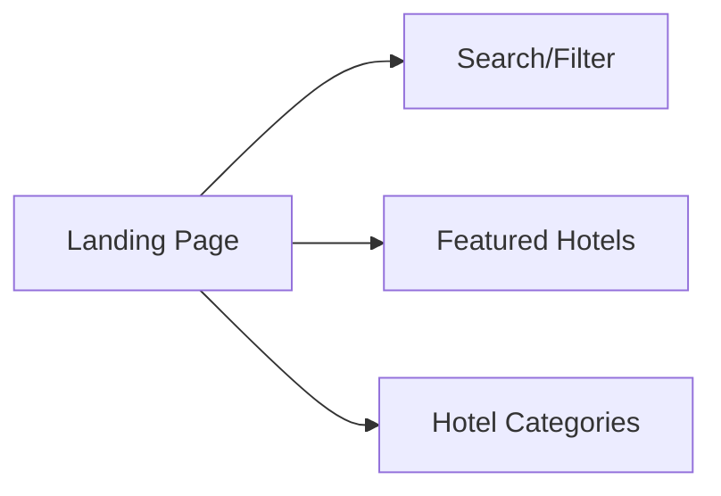
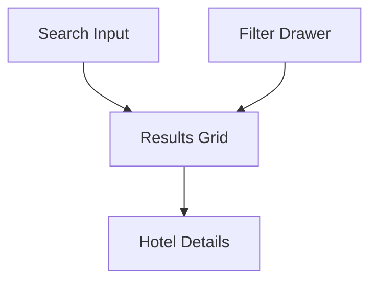
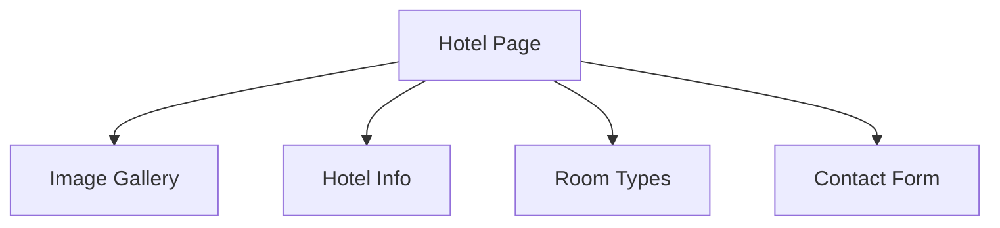

# Product Context

## Purpose & Vision

Hotel Swiss serves as a centralized platform for discovering and exploring hotels across Switzerland. The platform bridges the gap between hotels and potential guests by providing detailed information, visual content, and direct contact options.

## User Experience Goals

### 1. Hotel Discovery

- **Problem**: Users need to find hotels that match their specific requirements
- **Solution**: Advanced filtering system with multiple criteria
  - Location (cantons)
  - Price range
  - Amenities
  - Star rating

### 2. Visual Exploration

- **Problem**: Users want to see what they're booking
- **Solution**: Rich media gallery
  - Grid layout for overview
  - Full-screen gallery mode
  - Touch and keyboard controls
  - Image optimization for fast loading

### 3. Information Access

- **Problem**: Users need comprehensive hotel information
- **Solution**: Structured content presentation
  - Clear pricing information
  - Detailed amenities list
  - Room types and features
  - Location with map integration
  - Social media links

### 4. Contact & Booking

- **Problem**: Users need to reach hotels easily
- **Solution**: Integrated contact system
  - Contact form with date selection
  - Optional phone number
  - Direct messaging
  - Immediate feedback

### 5. Accessibility & Usability

- **Problem**: Users have different needs and preferences
- **Solution**: Universal design approach
  - Dark/light mode
  - Multilingual support
  - Responsive design
  - Keyboard navigation
  - Screen reader support

## User Flow

### 1. Landing Experience

### 2. Search & Filter

### 3. Hotel Details

## Content Strategy

### 1. Hotel Presentation

- Hero image with gallery access
- Title and key information
- Detailed description
- Amenities and features
- Room types and pricing
- Location and directions

### 2. Visual Content

- High-quality images
- Optimized thumbnails
- Responsive sizing
- Lazy loading
- Fallback images

### 3. Interactive Elements

- Image gallery
- Contact forms
- Maps
- Social links
- Navigation elements

## Localization Strategy

### 1. Language Support

- English (Default)
- French
- German
- Italian

### 2. Content Types

- UI elements
- Hotel descriptions
- Error messages
- Form labels
- Meta information

## Performance Goals

### 1. Loading Speed

- Initial load < 2s
- Image optimization
- Code splitting
- Caching strategy

### 2. Interaction

- Smooth animations
- Responsive controls
- Immediate feedback
- Error prevention

### 3. Accessibility

- WCAG compliance
- Keyboard navigation
- Screen reader support
- Color contrast
- Focus management
