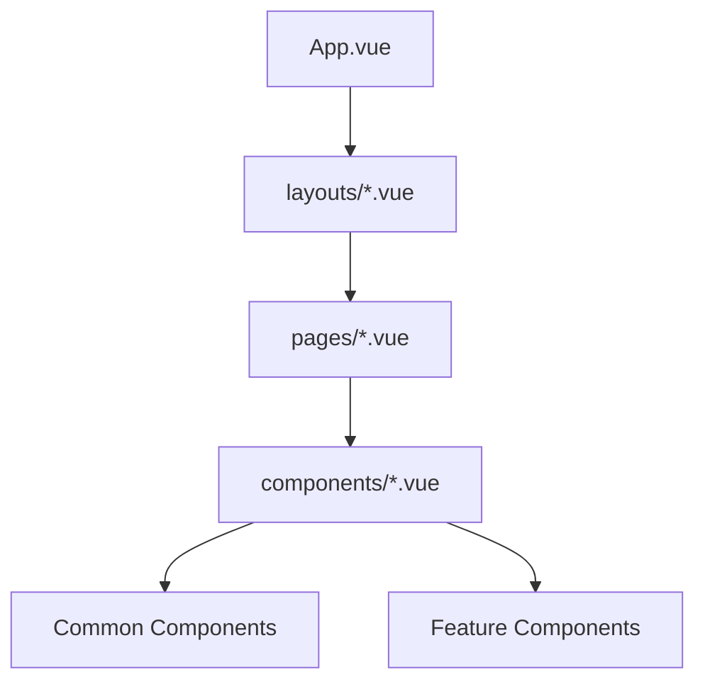

# System Patterns

## Architecture Overview

### Component Structure



## Design Patterns

### 1. Container Pattern

```html
<!-- Container with responsive padding -->
<div class="container">
  <!-- No padding on mobile, 1rem from md up -->
  <!-- Automatically centered -->
</div>
```

### 2. Composable Pattern

Used for reusable logic across components:

```typescript
// useDarkMode.ts
const isDark = ref(false);
export const useDarkMode = () => {
  // Shared state pattern
  return {
    isDark,
    toggleDarkMode,
  };
};
```

### 3. Component Props Pattern

```typescript
// Strict prop typing
defineProps<{
  images: Array<Image> | null;
  visible: boolean;
}>();

// With defaults
withDefaults(defineProps<Props>(), {
  defaultView: "grid",
});
```

### 4. Event Handling Pattern

```typescript
// Event emitter typing
const emit = defineEmits<{
  "update:visible": [value: boolean];
  submit: [data: FormData];
}>();
```

### 5. Store Pattern (Pinia)

```typescript
export const useHotelStore = defineStore("hotel", {
  state: () => ({
    currentHotel: null,
    images: [],
  }),
  actions: {
    setHotel(hotel: Hotel) {
      this.currentHotel = hotel;
    },
  },
});
```

## Component Patterns

### 1. Gallery Pattern

- Drawer for full-screen view
- Grid layout for thumbnails
- Gesture support for mobile
- Keyboard navigation
- Image optimization

### 2. Form Pattern

- Validation
- Error handling
- Loading states
- Success feedback
- Optional fields

### 3. Filter Pattern

- Drawer for mobile
- Immediate updates
- Clear all option
- State persistence

## Styling Patterns

### 1. Dark Mode Implementation

```typescript
// Theme toggle
const toggleDarkMode = () => {
  isDark.value = !isDark.value;
  updateTheme(isDark.value);
};

// CSS classes
("bg-light dark:bg-dark-100"); // Use darker background for better contrast
("text-primary-200 dark:text-light"); // Light text in dark mode
("border-primary/30 dark:border-primary-200/20"); // Subtle borders
("shadow-md dark:shadow-primary-200/20"); // Themed shadows
```

### 2. Responsive Design

```html
<!-- Mobile-first approach -->
<div
  class="grid grid-cols-1 sm:grid-cols-2 md:grid-cols-3 lg:grid-cols-4"
></div>

<!-- Container padding -->
<div class="container">
  <!-- No padding on mobile, 1rem from md up -->
</div>
```

### 3. Animation Patterns

```css
.animate-fade-in {
  animation: fadeIn 0.3s ease-in-out;
}

.transition-all {
  transition-property: all;
  transition-timing-function: cubic-bezier(0.4, 0, 0.2, 1);
  transition-duration: 150ms;
}
```

## Data Flow Patterns

### 1. API Integration

```typescript
// API data fetching
const response = await useHotelApiData(`hotels/${id}`);
hotel.value = response.data.value as Hotel;
```

### 2. State Management

```typescript
// Component state
const localState = ref([]);

// Store state
const store = useHotelStore();
store.setHotel(hotel);
```

### 3. Props Down, Events Up

```vue
<!-- Parent -->
<HotelHero :images="hotel?.images" @openImageModal="openImageModal" />

<!-- Child -->
<button @click="$emit('openImageModal')"></button>
```

## Error Handling Patterns

### 1. Try-Catch Pattern

```typescript
try {
  const response = await useHotelApiData(...)
} catch (error) {
  console.error(error)
} finally {
  pending.value = false
}
```

### 2. Fallback Content

```vue
<template>
  <div v-if="error">Error state</div>
  <div v-else-if="loading">Loading...</div>
  <div v-else>Content</div>
</template>
```

## Testing Patterns

### 1. Component Testing

```typescript
// Component mounting
const wrapper = mount(Component, {
  props: {
    images: mockImages,
  },
});
```

### 2. Integration Testing

```typescript
// API integration tests
test('fetches hotel data', async () => {
  const hotel = await useHotelApiData(...)
  expect(hotel).toBeDefined()
})
```
